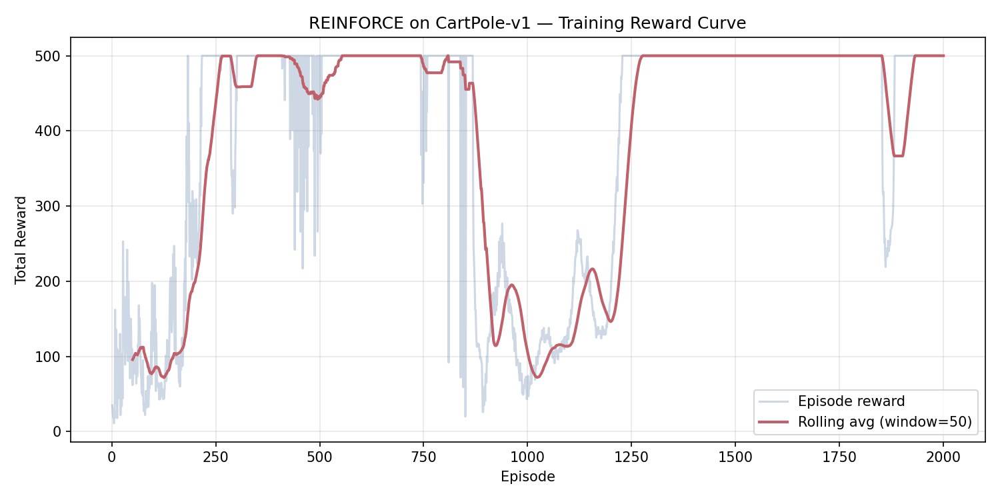

# CartPole REINFORCE — Policy Gradient from Scratch

A from-scratch implementation of the **REINFORCE policy gradient algorithm** in PyTorch, trained to solve the **CartPole-v1** environment from Gymnasium. No RL libraries, no shortcuts — every line of the training loop, the loss function, and the reward computation is written and understood from first principles. Built as a foundational reinforcement learning project to develop the core skills required for robotics control (PPO, SAC) and eventually sim-to-real transfer on platforms like Tesla Optimus.

---

## Table of Contents

- [Why This Project](#why-this-project)
- [Results](#results)
- [The REINFORCE Algorithm](#the-reinforce-algorithm)
- [Network Architecture](#network-architecture)
- [Hyperparameter Experiments](#hyperparameter-experiments)
- [Reproducing the Results](#reproducing-the-results)
- [Project Structure](#project-structure)
- [Implementation Details](#implementation-details)
- [What I'd Improve Next](#what-id-improve-next)
- [License](#license)

---

## Why This Project

Every modern reinforcement learning system — from MuJoCo locomotion to robotic manipulation to RLHF in language models — is built on the same fundamental loop:

> **Collect trajectory → Compute return → Update policy**

This project implements that loop from scratch in the simplest possible environment (CartPole), where a bug in the algorithm can be distinguished from a bug in the environment. The three concepts learned here transfer directly to every harder RL problem:

1. **The MDP framing** — states, actions, rewards, transitions
2. **The policy gradient theorem** — training a neural network directly on reward signal, without labelled data
3. **The training loop pattern** — reused unchanged in PPO, A2C, and every actor-critic method

CartPole was chosen deliberately over flashier environments. In a complex setting, debugging is ambiguous; here, if the agent fails to learn, the cause is almost certainly in the algorithm — making the learning loop tight.

---

## Results

### Solved ✅

The trained agent achieves an **average reward of 493.4 ± 24.6 over 100 greedy evaluation episodes**, exceeding the CartPole-v1 solved threshold of 475.

| Metric | Value |
|---|---|
| Average reward (100 episodes) | **493.4** |
| Standard deviation | ± 24.6 |
| Min / Max | 316 / 500 |
| Solved threshold | ≥ 475 |
| Training time | ~3 minutes (MacBook Air M4, CPU only) |
| Training episodes | 2,000 |

### Training Reward Curve

The plot below shows the per-episode reward during training (light blue) with a 50-episode rolling average overlay (red). The agent progresses from a random policy (~20 steps) to consistently reaching the maximum score of 500.



---

## The REINFORCE Algorithm

*Written in my own words, not copied from a textbook.*

REINFORCE learns by trial and error. There are no labelled examples saying "in this state, push left." Instead, the agent generates its own training data:

1. **Play a full episode**: The policy network observes the cart state (position, velocity, pole angle, angular velocity), outputs a probability distribution over actions (push left or right), and *samples* from it. Sampling — not taking the best action — is critical for exploration. The episode continues until the pole falls or 500 steps elapse.

2. **Score each action retroactively**: For every timestep, compute the **reward-to-go** — the discounted sum of all future rewards from that point onward. This answers: "how much total reward followed this particular action?" Actions early in a long episode get high reward-to-go; actions just before failure get low reward-to-go.

3. **Update the policy**: The loss function is deceptively simple:

   ```
   loss = -mean( log π(aₜ | sₜ) × Gₜ )
   ```

   Where `log π(aₜ | sₜ)` is the log-probability the network assigned to the action it took, and `Gₜ` is the reward-to-go. Minimising this loss *increases* the probability of actions that led to high returns and *decreases* the probability of actions that led to low returns.

4. **Repeat** for hundreds or thousands of episodes.

### Why Baseline Subtraction Matters

The key weakness of vanilla REINFORCE is **high variance**. In CartPole, all rewards are +1 (you get a point for every step the pole stays up), so all returns are positive. Without adjustment, the algorithm reinforces *every* action — both good and bad — just by different amounts.

**Baseline subtraction** fixes this by subtracting the average return from each `Gₜ` before computing the loss. Actions that produced above-average returns get reinforced; below-average returns get discouraged. This doesn't change what the algorithm optimises for, but it dramatically reduces noise in the gradient estimates.

The effect is clearly visible in the [experiment results](#hyperparameter-experiments) below: with baseline subtraction, the agent solves CartPole reliably. Without it, training collapses entirely.

---

## Network Architecture

A deliberately simple two-layer feedforward network. CartPole's 4-dimensional state space doesn't warrant anything larger.

```
Input Layer:    4 units   ← [cart position, cart velocity, pole angle, angular velocity]
                ↓
Hidden Layer:   128 units, ReLU activation
                ↓
Output Layer:   2 units   → [P(push left), P(push right)]
                ↓
Softmax         → valid probability distribution over actions
```

| Component | Detail |
|---|---|
| Parameters | 4×128 + 128 + 128×2 + 2 = **898 total** |
| Optimiser | Adam (lr = 0.01) |
| Framework | PyTorch (no RL library dependencies) |

During **training**, actions are *sampled* from the output distribution for exploration.  
During **evaluation**, the *argmax* action is taken (greedy / deterministic).

---

## Hyperparameter Experiments

Running experiments and documenting results is what separates a tutorial-following project from one that demonstrates real understanding. Below are four training configurations, each with one variable changed, compared against the baseline.

### Summary Table

| Experiment | Change Made | Final Avg(50) | Solved? | Key Observation |
|---|---|---|---|---|
| **Baseline** | Default (lr=0.01, γ=0.99, hidden=128, baseline ON) | **500.0** | ✅ | Stable from episode 850+. Consistent perfect scores. |
| **No baseline** | Removed baseline subtraction (`--no-baseline`) | 9.6 | ❌ | Showed initial promise (peaked at 269) then **collapsed permanently** at episode 650. |
| **Higher LR** | Learning rate 5× higher (`--lr 0.05`) | 9.3 | ❌ | Collapsed within 50 episodes. **Never showed any learning signal.** |
| **Smaller network** | Hidden layer 32 units instead of 128 (`--hidden-dim 32`) | **500.0** | ✅ | Solved! More dips during training but converged to perfect score. |

### Detailed Analysis

#### Experiment 1: No Baseline Subtraction
```
python train.py --no-baseline --episodes 2000 --seed 42
```

This is the most pedagogically valuable experiment. Without baseline subtraction, all returns in CartPole are positive (+1 per step), so the algorithm reinforces every action — both good and bad. The gradient signal is overwhelmed by noise.

**What happened**: The agent learned briefly (reaching 269 steps around episode 450), then entered a death spiral. The policy became deterministic (one action got ~100% probability), exploration ceased, and gradients vanished. Loss dropped to exactly `0.0000` and stayed there for the remaining 1,300 episodes. The agent was permanently stuck at ~9 steps — *worse* than the random baseline of ~20.

**Takeaway**: Baseline subtraction is not optional for REINFORCE on environments with all-positive rewards.

#### Experiment 2: Higher Learning Rate (lr=0.05)
```
python train.py --lr 0.05 --episodes 2000 --seed 42
```

**What happened**: The first weight update was so large that the policy immediately became deterministic. By episode 50, the agent was stuck at 9 steps with zero loss. The entire 2,000-episode run completed in just 4.1 seconds because each episode was only ~9 steps long.

**Takeaway**: In policy gradient methods, the learning rate must be conservative. A 5× increase was catastrophic — the policy overshot into a region from which it could never recover.

#### Experiment 3: Smaller Network (hidden=32)
```
python train.py --hidden-dim 32 --episodes 2000 --seed 42
```

**What happened**: The 32-unit network solved CartPole just as effectively as the 128-unit default, though with slightly more variance during training (more dips before stabilising). It still reached perfect 500.0 average by the end.

**Takeaway**: For simple, low-dimensional environments like CartPole, network size has minimal impact on final performance. The 32-unit network has only **234 parameters** vs 898 in the default — a 74% reduction with no loss in capability. However, the 128-unit network trains more stably, with fewer temporary performance dips.

---

## Reproducing the Results

### Prerequisites

- Python 3.9+
- macOS, Linux, or Windows
- No GPU required

### Setup

```bash
git clone https://github.com/dalchandrana/cartpole-reinforce.git
cd cartpole-reinforce
pip install -r requirements.txt
```

### Train

```bash
# Default configuration (~3 min on MacBook Air M4)
python train.py --episodes 2000 --seed 42
```

Output files:
- `checkpoints/policy_reinforce.pt` — trained model weights
- `checkpoints/training_config.json` — hyperparameters used
- `experiments/reward_curve.png` — training reward plot
- `experiments/reward_log.csv` — per-episode reward data

### Evaluate

```bash
# Run trained policy greedily for 100 episodes
python evaluate.py
```

### Run Experiments

```bash
# No baseline subtraction
python train.py --no-baseline --episodes 2000 --seed 42

# Higher learning rate
python train.py --lr 0.05 --episodes 2000 --seed 42

# Smaller network
python train.py --hidden-dim 32 --episodes 2000 --seed 42
```

### CLI Reference

| Flag | Default | Description |
|---|---|---|
| `--episodes` | 2000 | Number of training episodes |
| `--lr` | 0.01 | Learning rate for Adam optimiser |
| `--gamma` | 0.99 | Discount factor for reward-to-go |
| `--hidden-dim` | 128 | Hidden layer size |
| `--seed` | 42 | Random seed for reproducibility |
| `--no-baseline` | (off) | Disable baseline subtraction (ablation) |

---

## Project Structure

```
CartPole/
├── policy.py          # PolicyNetwork (nn.Module) — 4→128→2, ReLU + Softmax
├── train.py           # REINFORCE training loop, episode collection, gradient check
├── evaluate.py        # Greedy evaluation — argmax over 100 episodes
├── utils.py           # Reward-to-go (backward), baseline subtraction, plotting
├── experiments/       # Generated: reward curves, logs, evaluation results
├── checkpoints/       # Generated: saved model weights and training config
├── requirements.txt   # torch, gymnasium, matplotlib, numpy
├── README.md          # This file
└── LICENSE            # MIT
```

---

## Implementation Details

### Reward-to-Go Computation (Backward)

One of the two most common bugs in a first REINFORCE implementation is computing reward-to-go forward instead of backward. This implementation works from the last timestep backward, computing each `G_t` in O(1) from `G_{t+1}`:

```python
# utils.py — compute_rewards_to_go()
running_return = 0.0
for r in reversed(rewards):
    running_return = r + gamma * running_return
    rewards_to_go.insert(0, running_return)
```

A 3-step manual test verifies correctness:
- Input: `rewards = [1.0, 1.0, 1.0]`, `gamma = 0.99`
- Expected: `G = [2.9701, 1.99, 1.0]` ✅

### Gradient Sanity Check

Before training begins, a single-episode gradient check verifies that `loss.backward()` produces non-zero gradients in all four parameter tensors (two weight matrices, two bias vectors). This catches silent bugs like detached tensors or frozen layers.

### Training vs Evaluation Action Selection

| Phase | Method | Why |
|---|---|---|
| Training | `Categorical(probs).sample()` | Exploration: must try different actions to discover what works |
| Evaluation | `torch.argmax(probs)` | Exploitation: always pick the best-known action |

---

## What I'd Improve Next

These improvements are deliberately saved for future projects, building on the foundation established here:

- **PPO (Proximal Policy Optimization)**: Add the clipped surrogate objective and multiple update epochs per batch. PPO is the standard algorithm used in production RL systems (including RLHF for language models). The trajectory collection and reward computation from this project transfer directly.

- **Actor-Critic Architecture**: Replace the simple batch-mean baseline with a learned value function (critic network) that estimates expected returns from each state. This provides a per-state baseline rather than a per-batch one, further reducing gradient variance.

- **Harder Environments**: Transfer to MuJoCo locomotion tasks (HalfCheetah, Hopper) where the state space is higher-dimensional and the physics simulation is more complex. The training loop pattern remains identical; the network architecture and hyperparameters change.

- **Entropy Bonus**: Add an entropy regularisation term to the loss (`loss = policy_loss - β * entropy`) to explicitly encourage exploration and prevent premature convergence to deterministic policies — the exact failure mode observed in the no-baseline and high-LR experiments.

---

## License

[MIT](LICENSE)
